# Day 2

## Info - Ansible role
<pre>
- is a way we can write reusable code
- ansible roles can't be executed like playbooks directly
- ansible roles is similar to DLL(Dynamic Link Library) - it has reusable code but can't be executed directly
- just like dll can be invoked from application, ansible roles can be invoked from ansible playbooks
- the same ansible role can be used from multiple playbooks
- ansible roles following a recommended directory structure
- it looks like a playbook but it is not a playbook
- using ansible-galaxy one can download and use read-made ansible roles from galaxy.ansible.com portal
- we could also develop our custom ansible role using ansible-galaxy tool
</pre>

## Lab - Developing an ansible role to install nginx,configure web root folder and deploy custom web page
```
cd ~/terraform-sep2226-2025
git pull
cd Day1/ansible/role
ansible init nginx
tree nginx

ansible-playbook install-nginx-playbook.yml
```

## Lab - Installing AWX 

#### Let's install minikube
```
curl -LO https://github.com/kubernetes/minikube/releases/latest/download/minikube-linux-amd64
sudo install minikube-linux-amd64 /usr/local/bin/minikube && rm minikube-linux-amd64

minikube config set cpus 4
minikube config set memory 12288
minikube start --driver=docker

# Download kubectl
curl -LO "https://dl.k8s.io/release/$(curl -L -s https://dl.k8s.io/release/stable.txt)/bin/linux/amd64/kubectl"
chmod +x ./kubectl
sudo mv kubectl /usr/local/bin

docker ps -a
minikube start
minikube status
kubectl get nodes
```
Expected output


#### Let's install 
```
# Clone the awx operator to install Ansible Tower within minikube
git clone https://github.com/ansible/awx-operator.git
cd awx-operator
git checkout tags/2.7.2
export VERSION=2.7.2

# Install make
sudo apt install make -y
make deploy
```

#### Check if the AWX required pods are running
```
kubectl get pods -n awx -w
```

#### Troubleshooting pods crash and AWX Dashboard login failure

Create a file named kustomization.yaml with below code
<pre>
apiVersion: kustomize.config.k8s.io/v1beta1
kind: Kustomization
namespace: awx
resources:
  - github.com/ansible/awx-operator/config/default?ref=2.19.1

images:
  - name: quay.io/ansible/awx-operator
    newTag: 2.19.1
</pre>

Apply
```
kubectl apply -k .
```

#### Let's create a nodeport service for AWX
Create a file awx.yml with the below code
<pre>
---
apiVersion: awx.ansible.com/v1beta1
kind: AWX
metadata:
  name: awx-tower
spec:
  service_type: nodeport
</pre>

Let's create the ansible tower instance
```
kubectl config set-context --current --namespace=awx
kubectl apply -f awx.yml
kubectl logs -f deployments/awx-operator-controller-manager -c awx-manager
kubectl get svc -l "app.kubernetes.io/managed-by=awx-operator"
```
You may access the ansible tower webconsole
```
http://192.168.49.2:30181
```


Retrieve the password
```
kubectl get secret awx-tower-admin-password -n awx -o jsonpath='{.data.password}' | base64 -d; echo
```

Login credentials
<pre>
username - admin
password - 
</pre>

Once you login, you will get the below page
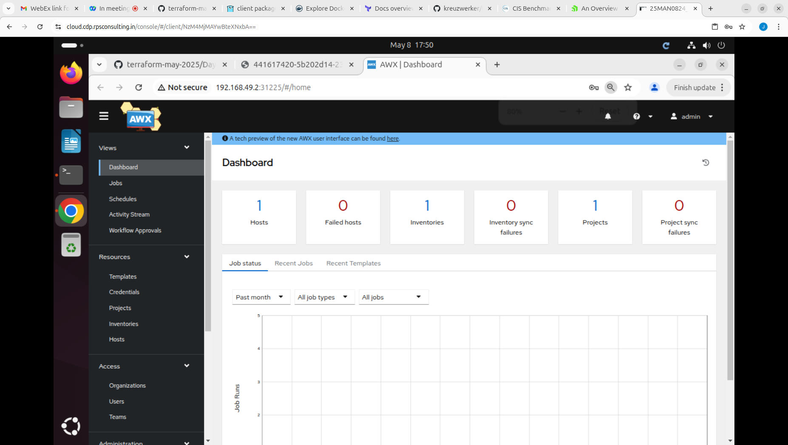

## Lab - Creating a Project in Ansible AWX

Navigate to Ansible Automation Platform on your RPS Lab machine - chrome web browser
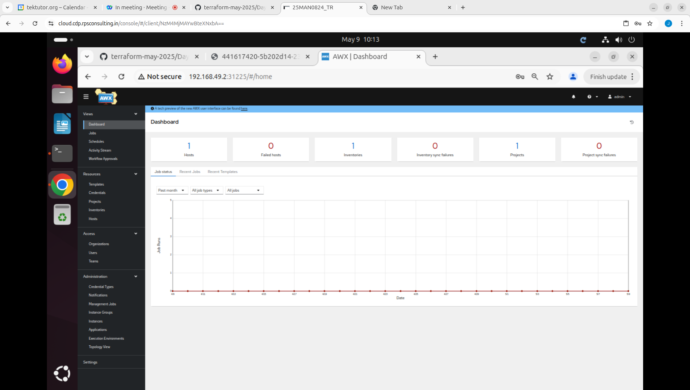

On the menu that appears on the left side, Navigate to Resources --> Projects


Click "Add"

<pre>
Under the Name, type "TekTutor Training Repository"
Under the Source Code Type, select "Git"
Under the Source Control url, type "https://github.com/tektutor/terraform-may-2025.git"
Under the Source Control Branch/Tag/Commit, type "main"
Under the Options, enable the check box that says "Update Revision on Launch"
</pre>

Click "Save"


Click "Successful"


## Lab - Creating Inventory in Ansible Automation Platform(AWX)

Navigate to Ansible Automation Platform(AWX)


Click Resources --> Inventories

Click Add
Select the first option "Add Inventory


Click "Save"

Click the Tab named "Hosts" within the Inventory you saved just now

Click "Add"


Click "Save"


click Add to create other ansible nodes on the similar fashion


Click "Save"

click Add to create other ansible nodes on the similar fashion

Click "Add"


Click "Save"


Repeat the procedure to add "Rocky2"


To verify if all the hosts(ansible nodes) added to the inventory are reachable to Ansible Tower, Click on your inventory and move to the Hosts tab
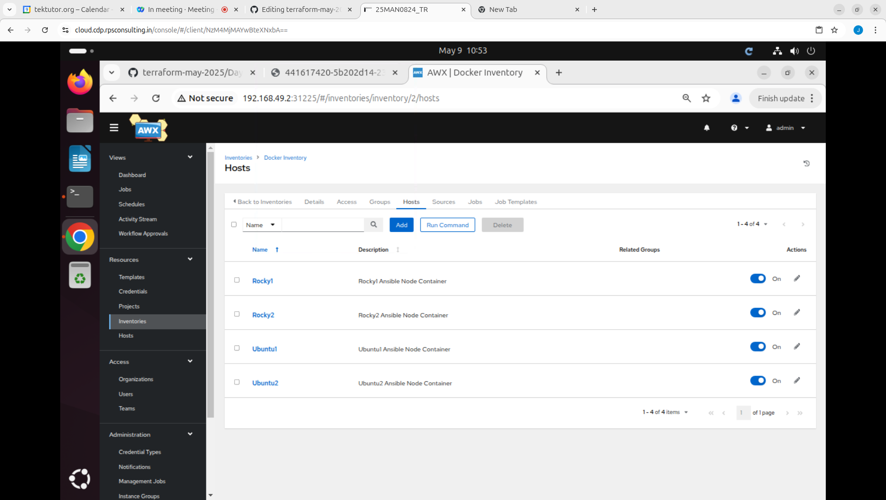
Click "Run command"
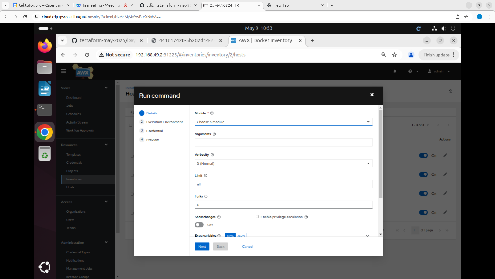
Under the Module, choose "ping"


Click "Next"

Click "Next"

Select "RPS Private Key" we saved
Click "Next"

Click "Launch"
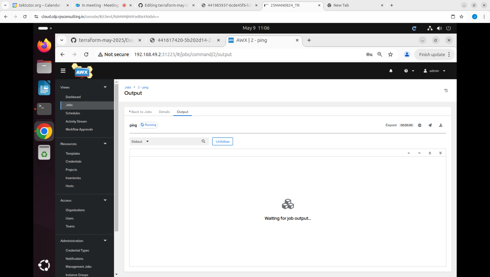


## Lab - Creating Credentials to store the Private key 
Navigate to Ansible Tower Dashboard


Click Resources --> Credentials

Click "Add"


Select "Machine" Credential Type

Open your RPS Cloud Machine Terminal, type "cat /home/rps/.ssh/id_ed25519"

Copy the private key including the Begin and End as shown below

Paste the private key you copied under the "SSH Private Key" field (Remove extra space)

Scroll down to save
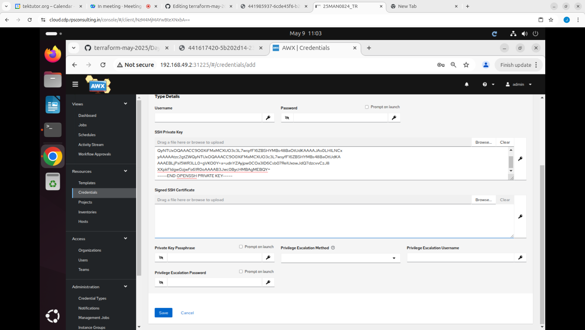
Click Save


## Lab - Creating Job Template to invoke a playbook from Ansible Tower
Navigate to Ansible Tower Dashboard
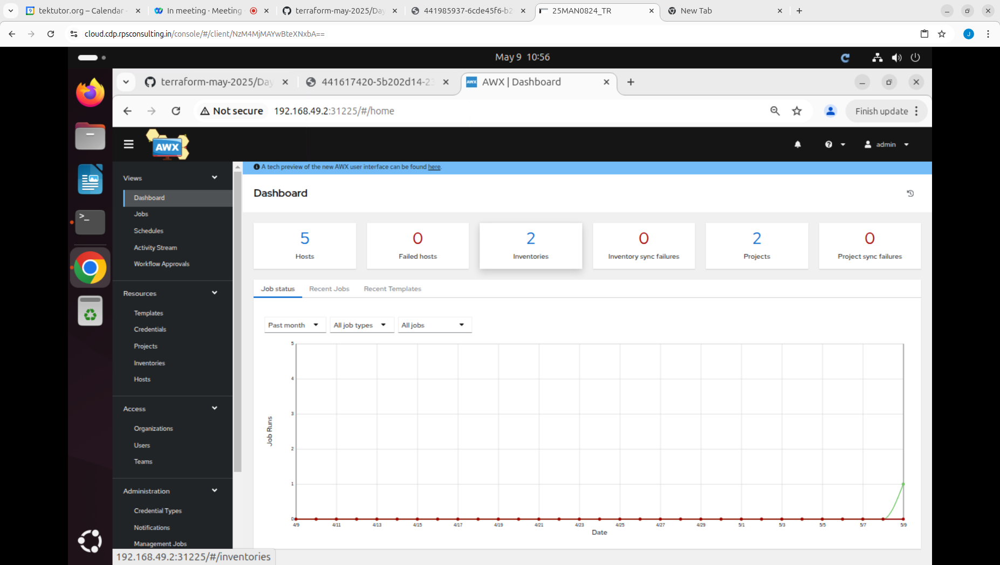

Click "Resources->Templates"

Click "Add"

Select "Add Job Template"

<pre>
Under the Name, type "Install nginx playbook"
Click Search in Inventory and select "Docker Inventory" that we created
</pre>


Click Search in Project and Select "TekTutor Training Repository"
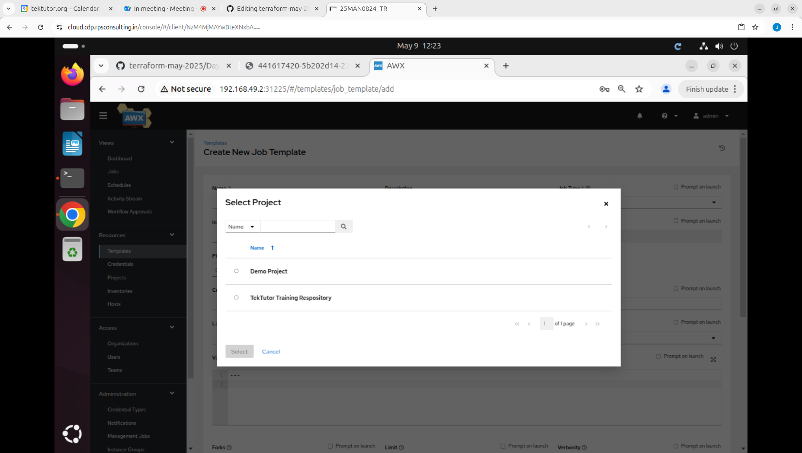


Under the Playbook, select "Day2/ansible/after-refactoring/install-nginx-playbook.yml"

Under Credential, click search and select "RPS private key file"
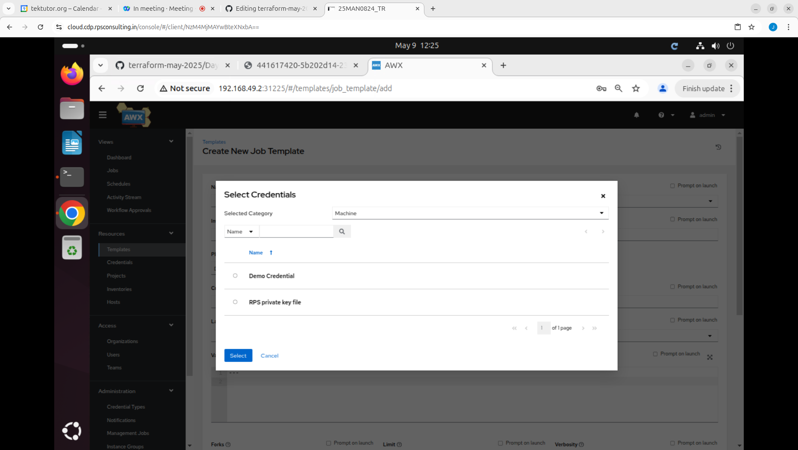


Scroll down and click "Save"
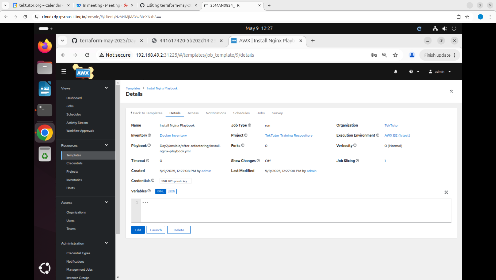


To run the playbook, click "Launch" Button


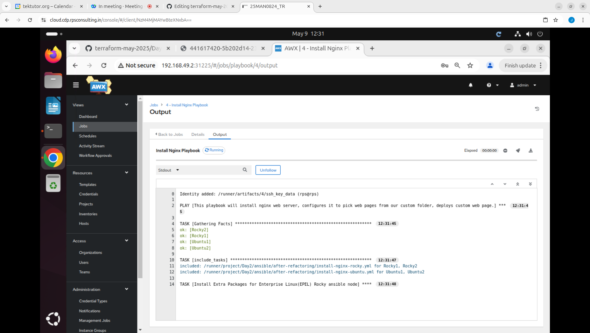


