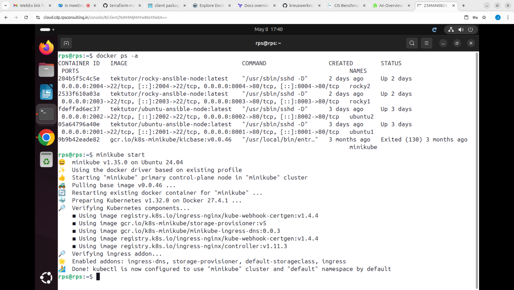
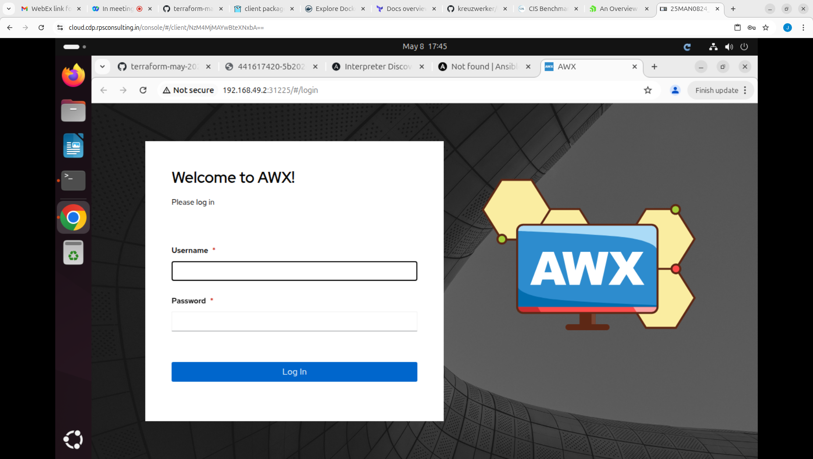
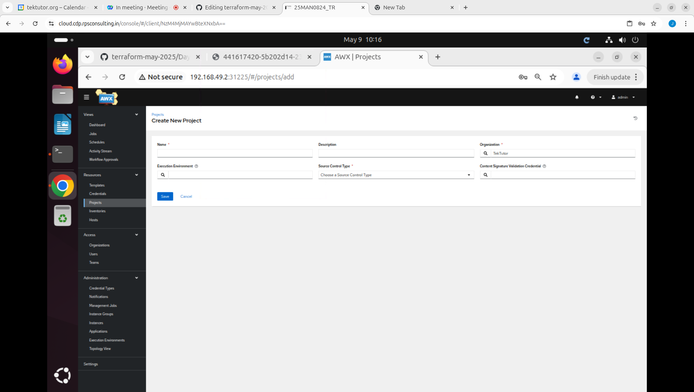
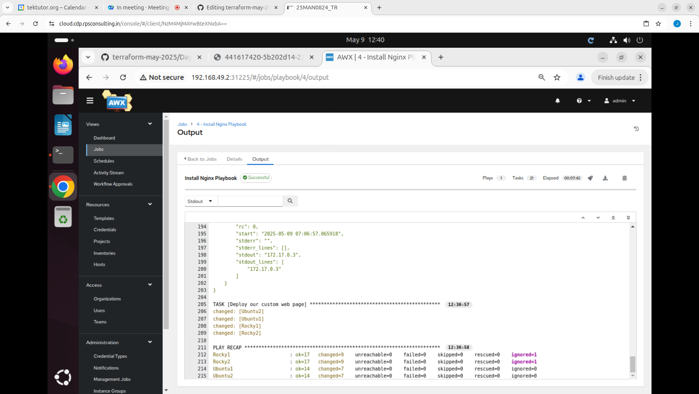

# Day 2

## Info - Ansible role
<pre>
- is a way we can write reusable code
- ansible roles can't be executed like playbooks directly
- ansible roles is similar to DLL(Dynamic Link Library) - it has reusable code but can't be executed directly
- just like dll can be invoked from application, ansible roles can be invoked from ansible playbooks
- the same ansible role can be used from multiple playbooks
- ansible roles following a recommended directory structure
- it looks like a playbook but it is not a playbook
- using ansible-galaxy one can download and use read-made ansible roles from galaxy.ansible.com portal
- we could also develop our custom ansible role using ansible-galaxy tool
</pre>

## Lab - Developing an ansible role to install nginx,configure web root folder and deploy custom web page
```
cd ~/terraform-sep2226-2025
git pull
cd Day2/ansible/role
ansible-galaxy init nginx
tree nginx

cp scripts/default nginx/files
cp scripts/nginx.conf nginx/files
cp scripts/index.html.j2 nginx/templates
cp scripts/nginx-vars.yml nginx/defaults
cp scripts/nginx-vars.yml nginx/vars
cp scripts/restart* nginx/handlers
cp scripts/*.yml nginx/tasks
tree nginx

ansible-playbook install-nginx-playbook.yml
```


## Lab - Installing AWX 

#### Let's install minikube
```
curl -LO https://github.com/kubernetes/minikube/releases/latest/download/minikube-linux-amd64
sudo install minikube-linux-amd64 /usr/local/bin/minikube && rm minikube-linux-amd64

minikube config set cpus 4
minikube config set memory 12288
minikube start --driver=docker

# Download kubectl
curl -LO "https://dl.k8s.io/release/$(curl -L -s https://dl.k8s.io/release/stable.txt)/bin/linux/amd64/kubectl"
chmod +x ./kubectl
sudo mv kubectl /usr/local/bin

docker ps -a
minikube status
kubectl get nodes
```
Expected output



#### Let's install 
```
# Clone the awx operator to install Ansible Tower within minikube
git clone https://github.com/ansible/awx-operator.git
cd awx-operator
git checkout tags/2.7.2
export VERSION=2.7.2

# Install make
sudo apt install make -y
make deploy
```

#### Check if the AWX required pods are running
```
kubectl get pods -n awx -w
```

#### Troubleshooting pods crash and AWX Dashboard login failure

Create a file named kustomization.yaml with below code
<pre>
apiVersion: kustomize.config.k8s.io/v1beta1
kind: Kustomization
namespace: awx
resources:
  - github.com/ansible/awx-operator/config/default?ref=2.19.1

images:
  - name: quay.io/ansible/awx-operator
    newTag: 2.19.1
</pre>

Apply
```
kubectl apply -k .
```

#### Let's create a nodeport service for AWX
Create a file awx.yml with the below code
<pre>
---
apiVersion: awx.ansible.com/v1beta1
kind: AWX
metadata:
  name: awx-tower
spec:
  service_type: nodeport
</pre>

Let's create the ansible tower instance
```
kubectl config set-context --current --namespace=awx
kubectl apply -f awx.yml
kubectl logs -f deployments/awx-operator-controller-manager -c awx-manager
kubectl get svc -l "app.kubernetes.io/managed-by=awx-operator"
minikube ip
kubectl get svc -n awx
```
You may access the ansible tower webconsole
```
http://192.168.49.2:30181
```


Retrieve the password
```
kubectl get secret awx-tower-admin-password -n awx -o jsonpath='{.data.password}' | base64 -d; echo
```

Login credentials
<pre>
username - admin
password - 
</pre>

Once you login, you will get the below page


## Lab - Creating a Project in Ansible AWX

Navigate to Ansible Automation Platform on your RPS Lab machine - chrome web browser


On the menu that appears on the left side, Navigate to Resources --> Projects


Click "Add"

<pre>
Under the Name, type "TekTutor Training Repository"
Under the Source Code Type, select "Git"
Under the Source Control url, type "https://github.com/tektutor/terraform-sep2226-2025.git"
Under the Source Control Branch/Tag/Commit, type "main"
Under the Options, enable the check box that says "Update Revision on Launch"
</pre>

Click "Save"


Click "Successful"


## Lab - Creating Inventory in Ansible Automation Platform(AWX)

Navigate to Ansible Automation Platform(AWX)


Click Resources --> Inventories

Click Add
Select the first option "Add Inventory


Click "Save"

Click the Tab named "Hosts" within the Inventory you saved just now

Click "Add"


Click "Save"


click Add to create other ansible nodes on the similar fashion


Click "Save"

click Add to create other ansible nodes on the similar fashion

Click "Add"


Click "Save"


Repeat the procedure to add "Rocky2"


To verify if all the hosts(ansible nodes) added to the inventory are reachable to Ansible Tower, Click on your inventory and move to the Hosts tab

Click "Run command"

Under the Module, choose "ping"


Click "Next"

Click "Next"

Select "RPS Private Key" we saved
Click "Next"

Click "Launch"


## Lab - Creating Credentials to store the Private key 
Navigate to Ansible Tower Dashboard


Click Resources --> Credentials

Click "Add"


Select "Machine" Credential Type

Open your RPS Cloud Machine Terminal, type "cat /home/rps/.ssh/id_ed25519"

Copy the private key including the Begin and End as shown below

Paste the private key you copied under the "SSH Private Key" field (Remove extra space)

Scroll down to save

Click Save


## Lab - Creating Job Template to invoke a playbook from Ansible Tower
Navigate to Ansible Tower Dashboard


Click "Resources->Templates"

Click "Add"

Select "Add Job Template"

<pre>
Under the Name, type "Install nginx playbook"
Click Search in Inventory and select "Docker Inventory" that we created
</pre>


Click Search in Project and Select "TekTutor Training Repository"


Under the Playbook, select "Day2/ansible/after-refactoring/install-nginx-playbook.yml"

Under Credential, click search and select "RPS private key file"


Scroll down and click "Save"


To run the playbook, click "Launch" Button





## Lab - Installing Golang in Ubuntu
```
cd ~
wget https://go.dev/dl/go1.25.1.linux-amd64.tar.gz
tar xvf go1.25.1.linux-amd64.tar.gz
```

Edit your /home/student/.bashrc and append the below at the end of the file
```
export PATH=$PATH:/home/student/go/bin
export GOROOT=/home/student/go
export GOPATH=/home/student/go/bin
```

To apply the exported variables 
```
source ~/.bashrc
```

Now you may verify the golang version
```
go version
```

It will report
<pre>
go version go1.25.1 linux/amd64  
</pre>


## Info - Golang Overview
<pre>
- golang is developed by Google using C programming language
- golang is a compiled programming language
- golang syntax resembles very close to C programming language
- golang has 25 keywords
- golang only supports for loop
- just like C/C++/C# main function is the entry-point function ( the very function that will invoked when you run a go application )
- golang supports pointers but memory is managed by garbage collector unlike C/C++
- golang doesn't support class
- golang only supports functions
- using golang one can develop a new compiler/interpreter, a game, console based application, graphical application that runs on your local machine, can develop mobile applications, can develop AI/ML applications, web applications, etc.,
- using golang one can develop REST API, Microservices, etc.,
- is case-sensitive
- statically typed programming language
- performance wise, it is faster than most compiled languages, definitely more faster than interpretted and scripting languages
- even compilation is done faster in go lang for bulky applications
- Some of the popular tools developed in Golang
  - Terraform
  - Docker
  - Kubernetes
  - Openshift  
</pre>

## Info - Golang keywords
<pre>
- break
- default
- func
- interface
- select
- case
- defer
- go
- map
- struct
- chan
- else
- goto
- package
- switch
- const
- fallthrough
- if
- range
- type
- continue
- for
- import
- return
- var
</pre>

## Lab - Write your first Hello World in golang
Create a file named hello.go with the below content
<pre>
package main

import "fmt"

func main() {
  fmt.Println ("Hello World !")
}
</pre>

Run your application
```
go run ./hello.go
```


## Lab - Accepting user inputs

Create a file named userinputs.go with the below content
<pre>
package main

import "fmt"

func main() {
	//The below line declares variables named x and y and initializes them with value 0
	x := 0

	//This is yet another way we can declare variables in go lang
	var y int

	//This is an ansignment
	y = 0

	fmt.Print("Enter your first integer input :" )
	fmt.Scanf("%d", &x)

	fmt.Print("Enter your second integer input :" )
	fmt.Scanf("%d", &y)

	fmt.Println("Value of x :", x )
	fmt.Println("Value of y :", y )

	var temp string
	fmt.Println("Press any key to exit ...")
	fmt.Scanln(&temp)
}  
</pre>

Run it
```
go run ./userinputs.go
```

## Lab - If else
Create file named if-else.go with the below code
```
package main

import "fmt"

func main() {
	x := 100

	if x % 2 == 0 {
	    fmt.Println(x, "is an even number")
	} else {
            fmt.Println(x, "is an odd number")
	}
}
```

Run it
```
go run ./if-else.go
```

## Lab - Golang arrays

Create a file named arrays.go with the below content
<pre>
package main

import "fmt"

func main() {

	//We have declared an array of integers of size 5
	//so we can store upto 5 integer values into this array
	//go lang array size is fixed
	//array index starts from 0
	//valid array index range is 0 to 4, total 5 values
	var arr [5]int

	//let's assign valaues into the array
	arr[0] = 10
	arr[1] = 20
	arr[2] = 30
	arr[3] = 40
	arr[4] = 50

	//arr[5] = 60 This will report array index out of bounds erro

	fmt.Println("Array elements are ...")
	fmt.Println(arr)

	count := len(arr)
	fmt.Println("Length of array :", count)

	//Modifying values stored in an array
	arr[3] = 25

	fmt.Println("Array elements are ...")
	for i := 0; i < count; i++ {
            fmt.Printf("%d\t", arr[i])
	}
	fmt.Println()
}	
</pre>

Run it 
```
go run ./array.go
```

## Lab - Golang error-handling

Create a file named error-handling.go with below code
<pre>
package main

import (
  "fmt"
  "os"
  "os/user"
  "github.com/sttk/stringcase"
)

func main() {
    u, err := user.Current()

    if err != nil {
       fmt.Println("Cannot get current user:", err)
       os.Exit(1)
    }

    fmt.Printf("Hello %s, welcome !\n", stringcase.PascalCase(u.Username) )
}	
</pre>

Run it
```
ls
go mod init main
cat go.mod
go mod tidy
cat go.mod
go run ./error-handling.go
```


## Lab - Golang user-defined functions

Create a file named functions.go with the below code
<pre>
	
package main

import "fmt"

func yetAnotherFunction() {
     fmt.Println("Yet Another Funciton invoked")
}

func main() {

}

//This function accepts a string input argument and returns a string output
func sayHello( msg string ) string {
  return "Hello, " + msg + " !"
}

/* function overloading is not supported in golang
func sayHello() string {
   return "Hello World !"
}
*/

</pre>

Run it
```
go run ./functions.go
```


